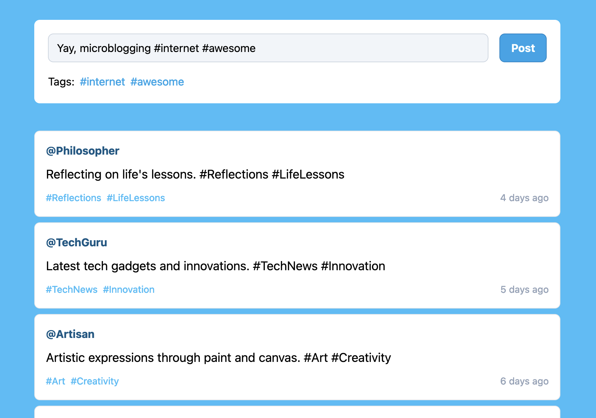

# Week 2: React app with components for objects

## Task
Create an application where you practice having different things in a state. I want you to choose an object that you find interesting to work with. It could be a product, a shoe, movies, or similar. But try to describe your object through a class.

Then create a component to manage an object in your state (will assist you with forms).

Create a component to manage lists of objects in your state (will help you with fetch results later).

## Description

A basic microblogging service built with React.

## Technologies Used

- React
- Vite
- Tailwind
- Visual Studio Code

